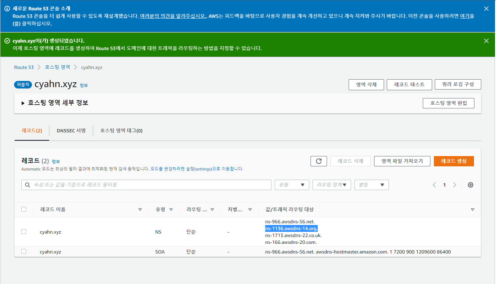

## Docker File

- **이미지** 만들 때 사용
- 컨테이너는 하나의 프로세스로 취급한다.
    - 컨테이너 안에서 여러 개의 프로세스를 돌릴 수 있는 편법은 있지만 권장되진 않는다.
    - 컨테이너 안에서는 하나의 프로세스만 돌릴 수 있다고 생각!
    - 따라서 내가 원하는 대로 도메인 서버, FTP 서버, Web 서버 등 여러 가지를 한 번에 실행되게 하고 싶을 때 도커파일로 작성해 이미지 생성 후 컨테이너를 실행시켜 하나의 프로세스로 여러 개가 실행되도록!!! 하는 것이다.

## 라우팅

- 이전까지는 로컬 가상머신 리눅스 서버에 ns 서버, 즉 도메인 서버를 직접 구현하여 운영되게 하였다.
- 하지만 지금은 AWS에서 제공해주는 라우팅 서비스로 손쉽게 도메인을 등록하여 연결할 수 있다.
- AWS router 생성 및 호스팅 네임서버 등록
    - AWS에서 Router53 서비스를 이용해 레코드를 생성한다.
    - AWS 네임서버 2개를 [hosting.kr](http://hosting.kr)의 내 도메인 네임서버로 등록한다.

    

    


## Docker File을 이용한 이미지 제작

- sed -i : 실제 파일의 내용 변경
    - sed -i 's/SELINUX=disabled/SELINUX=enforcing/g’ /etc/sysconfig/selinux
    - SELINUX=disabled → enforcing으로 변경

        


- 도커 파일 생성
    - vi DockerFile : 무조건 DockerFile이라고 파일명 지어야한다!

    

- 도커 파일 실행
    - build 명령어 사용
    - docker build -t cyahn/web:1.0 . : .은 현재 디렉토리 내의 파일을 의미

    

    - index.html 파일 생성

        

        - 만든 이미지의 사이즈를 보면 굉장히 크다. → alpine을 이용해 만들어야 한다.

- 컨테이너 생성

    

    


## 실습

```
1. httpd image 만들기
2. vsftpd image 만들기
3. bind image 만들기
4. 가능하면 bind에서 web, vsftpd 서비스를 가능하게
```

## Terraform

- IaC(Infrastructure As Code)
    - 구성 관리
        - Ansible
        - puppet
        - chef
    - 배포관리
        - Terraform
            - flatform에 종속되지 않는다 : AWS, GCP, AZURE, Ncloud, Kubernetes
            - Cloud Formation : 플랫폼 종속적, AWS에서만 가능
        - vagrant
    - DSL(Terraform, Ansible) ←→ GPL(c, python, java)
    - IaC
        - Human Error를 없애기 위해서
            - 1000대의 서버를 세팅해야 할 때 아무리 완벽한 사람이라도 실수하지 않고 완벽하게 해낸다는 보장이 없다!
        - 멱등성 : 몇번을 반복해도 동일한 결과를 보장

- local source → GIT HUB(인식) → Jenkins(test & build & cd) → production

- Terraform 설치
    - 쉽게 말해서, **원하는 인프라를 코드로 작성하여 서술할 수 있는 기술**
    - amd64 설치

    

    - 실행 파일 C로 옮긴 후 환경변수 등록
        - 시스템 변수에 경로 추가

        

    - vscode로 작업 진행
        - terraform 사용할 수 있는 초기 환경 구성
        - Terraform, HashiCorp 다운로드

            

        - Terraform 실행 파일 위치에 만든 폴더 open
        - 초기화 파일 생성 - 00_init.tf

            

            


- Terraform을 이용해 코드로 vpc 생성하기
    - vpc 정보
    - [https://registry.terraform.io/providers/hashicorp/aws/latest/docs/resources/vpc](https://registry.terraform.io/providers/hashicorp/aws/latest/docs/resources/vpc)
    - Terraform에서 제공하는 docs 참고할 것 - aws 문서들 다 나와있다!

        


    - 실행하기 전 IAM (사용자) 생성
        - ‘보안 자격 증명’에서 로그인 자격 증명 정보(액세스 키, 비밀번호)를 생성 시 단 한 번 확인할 수 있다.
        - cmd에서 aws 접속할 때 ID, PW가 필요하므로 꼭 저장해둬야한다.

        

        


    - cmd에서 접속 및 AWS 작업 진행하기 위해 AWS CLI 설치

        

        

        

    - plan

        

    - apply
        - plan 한번 더 실행되어 yes 입력해줘야한다.

        

        

        - AWS VPC가 생성된 것을 확인할 수 있다.

            

    - destory

- AWS Subnet 생성하기

    

    ```
    resource "aws_subnet" "cyahn_weba" {
      vpc_id = aws_vpc.cyahn_vpc.id
      cidr_block = "10.0.0.0/24"
      availability_zone = "ap-northeast-2a"
      tags = {
        "Name" = "cyahn-weba"
      }
    }

    resource "aws_subnet" "cyahn_webc" {
      vpc_id = aws_vpc.cyahn_vpc.id
      cidr_block = "10.0.1.0/24"
      availability_zone = "ap-northeast-2c"
      tags = {
        "Name" = "cyahn-webc"
      }
    }

    resource "aws_subnet" "cyahn_wasa" {
      vpc_id = aws_vpc.cyahn_vpc.id
      cidr_block = "10.0.2.0/24"
      availability_zone = "ap-northeast-2a"
      tags = {
        "Name" = "cyahn-wasa"
      }
    }

    resource "aws_subnet" "cyahn_wasc" {
      vpc_id = aws_vpc.cyahn_vpc.id
      cidr_block = "10.0.3.0/24"
      availability_zone = "ap-northeast-2c"
      tags = {
        "Name" = "cyahn-wasc"
      }
    }

    resource "aws_subnet" "cyahn_dba" {
      vpc_id = aws_vpc.cyahn_vpc.id
      cidr_block = "10.0.4.0/24"
      availability_zone = "ap-northeast-2a"
      tags = {
        "Name" = "cyahn-dba"
      }
    }

    resource "aws_subnet" "cyahn_dbc" {
      vpc_id = aws_vpc.cyahn_vpc.id
      cidr_block = "10.0.5.0/24"
      availability_zone = "ap-northeast-2c"
      tags = {
        "Name" = "cyahn-dbc"
      }
    }
    ```

    - 파일 저장 후 cmd 창에서 실행
        - terraform plan
        - terraform apply

        

        


    - AWS Subnet에서 확인할 수 있다.

- AWS Internet Gateway 생성하기

    

    - 동일하게 cmd에서 명령어 수행
        - terraform plan
        - terraform apply
    - AWS Internet Gateway에서 생성된 게이트웨이들을 확인해 볼 수 있다.

## 평가 과제


- AWS EC2 인스턴스 생성
    - 이전 vpc 교육 때문에 기본 VPC를 삭제하여 서브넷, 인터넷 게이트웨이까지 다 없는 상황이었다.
    - VPC에서 기본 VPC를 생성하면 서브넷과 인터넷 게이트웨이까지 자동으로 다 생성해준다 → 참고
    - 인스턴스 생성 후 탄력적 IP를 연결하여 퍼블릭 IP를 고정한다.
    - 인바운드 규칙을 편집해주어야 한다.
        - SSH - 22, HTTP - 80, MySQL - 3306 Open

    


- Docker, Haproxy, MySQL, Wordpress 설치
    - yum install -y Docker haproxy
    - docker pull mysql:5.7
    - docker pull wordpress
    - haproxy 설정파일 수정
        - vi /etc/haproxy/haproxy.cfg

        


    - mysql 컨테이너 생성

        

    - wordpress 컨테이너 생성

        


    - 로그로 로드밸런싱 확인
        - docker logs —tail 20 -f 컨테이너명
        - 20 : 출력 줄 수
        - -f : 포그라운드 방식으로 실행해 실시간으로 로그 확인 가능
        - 로그를 볼 수 없는 경우가 발생할 수 있다 ← 에러
            - wordpress를 80:80으로 설정해 컨테이너를 실행하면 aws ip주소로 접속할 때 기본 80 포트로 접속하는데 이 때 충돌이 발생할 수 있다.
            - 따라서 충돌에 의해 제대로 접속이 안되는 경우가 있으므로 포트 설정에 주의하자!

        


- haproxy와 도메인 연결
    - [hosting.kr](http://hosting.kr) 에서 AWS에서 제공하는 네임서버를 저장해준다.
    - 설정한다고 바로 접속되지 않는다!! → 조금 기다려야 적용된다!

    

    


- [cyahn.xyz](http://cyahn.xyz) 접속

    
