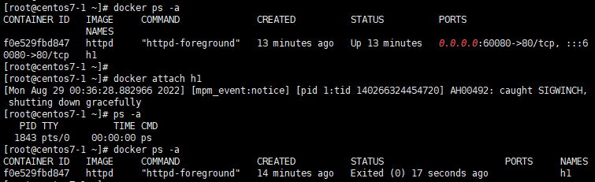

## 1. 프로세스 실행 방식

- httpd-foreground
    - 포그라운드 실행은 **쉘을 점유** → 명령어 안먹힘, 인터럽트만 가능
    - 점유하고 있기 때문에 ls 명령어 조차도 안먹는다.
    - attach로 접속하면 접속은 되지만 종료되어 버린다.
    
    
    
    - 따라서 exec 명령어를 사용해야 한다!
    
    
    

- background 실행
    - 쉘을 점유하지 않음, 명령어 먹힌다.
    - ping 8.8.8.8 & : 백그라운드로 실행되기 때문에 쉘 점유하지 않고, 다른 작업도 수행 가능

- ps aux
    - 프로세스 실행 목록 조회 명령어
    - 원격 접속, 시간 등 모든 정보 다 조회
    - kill -9 포트번호 : 포트번호로 프로세스 kill 가능
        - -19 : stop
        - -18 : start
    - ps -ef : 부모 프로세스까지 확인 가능한 명령어

- top
    - 명령어, 찾아보기

## 2. 컨테이너 → 도커 이미지 생성하기

- 실행 중인 컨테이너 도커 이미지로 만들기
    - commit
    
    
    
    - 생성한 이미지를 가지고 컨테이너 생성하기
        - 아까 index.html 수정한 파일을 가진다.
    
    
    
    
    
- 생성한 이미지 도커 허브에 업로드하기
    - 컨테이너 생성
        
        
        
    
    - index.html 수정
        - docker exec -it n1 /bin/bash : 쉘로 접속하겠단 의미
        
        
        
    
    - 도커 로그인
        - 이전에 로그인한 기록 있기 때문에 자동 로그인 된다.
            
            
            
    
    - hub.docker.com에 레포지토리 생성
        
        
        
    - 이미지 생성 후 도커 허브에 업로드 : commit & push
        
        
        
        
        
- 생성한 이미지 다른 시스템으로 보내기
    - [이미지] 전송 방식
        
        
        
        
        
        
        

- [export, import] 방식
    - import, export 방식으로 파일을 주고 받을 수 있지만 모든 설정이 다 초기화 되기 때문에 사용하기 번거롭다!
        - 컨테이너 생성 및 실행
        
        
        
        - 컨테이너 → 이미지로 생성
        
        
        
        
        
        - 원본 컨테이너의 설정파일에는 다음과 같이 실행방식이 명시되어있다.
            
            
            
        - centos7-2에서 파일 확인
            - export - import 방식 사용 시 설정이 다 초기화되는 문제 발생
            - 컨테이너 생성 시에 실행 방식을 명시해주는 옵션을 같이 넣어서 생성해줘야함!
            
            
            
            
            
            
            

## 3. 도커 네트워크

- 도커 네트워크 목록 : **브릿지**를 가장 많이 사용!


- 도커 네트워크 생성
    - 컨테이너 실행 시 네트워크 지정해주면 된다.
    
    
    
    
    
    
    
- 네트워크 host를 사용하면 호스트 피씨의 아이피 주소를 사용하므로 inspect로 조회했을 때 아무것도 설정되어있지 않는다.
    - 호스트로 실행하면 하나의 컨테이너만 실행할 수 있다.
    - 따라서 브릿지를 이용해서 내부에서 포트포워딩을 통해 여러 컨테이너를 실행한다.
    
    
    
    
    

## 4. 포트포워딩

- vi /etc/hosts
    - 서버 접속 시 네트워크 정보로 체크되는 파일들 중 하나
    - 이 호스트 파일에 centos7-1,2,3 아이피 주소를 넣어주면 ping으로 통신 가능하다.
    - ip 주소로도 통신할 수 있지만 컨테이너명으로는 통신할 수 없음을 확인할 수 있다.
        
        
        

- link
    - link을 이용해 컨테이너 생성 시 통신할 다른 컨테이너들을 연결해주면 컨테이너명 만으로도 통신 가능하다.
        
        
        
    - 또한 호스트 파일에 링크로 연결한 정보가 자동으로 들어가 있는 것을 확인할 수 있다.
        
        
        

- stop
    - docker stop 컨테이너명
    - 자원은 해지되지만 설정은 그대로 유지된다.
    - 따라서 새로운 컨테이너를 생성 및 실행했을 때 삭제된 컨테이너에 할당됐던 아이피 주소가 다시 재할당 되어 설정이 꼬일 수 있다.
    - 따라서 이것을 방지하기 위해 설정을 수동으로 수정해줘야 할 필요가 있다.

## 5. Local, Docker - wordpress, MySQL 설치

- docker pull wordpress
- docker pull mysql:5.7
- 도커로 실행시킬 때 환경변수가 필요한 이미지들이 있다.
    - wordpress 환경변수
    
    ```
    -e WORDPRESS_DB_HOST=db
    -e WORDPRESS_DB_USER=root
    -e WORDPRESS_DB_PASSWORD=IT12345!
    -e WORDPRESS_DB_NAME=wordpress
    --link db
    ```
    
    - mysql 환경변수
    
    ```
    -e MYSQL_ROOT_PASSWORD=IT12345!
    -e MYSQL_DATABASE=wordpress
    -e MYSQL_USER=root
    -e MYSQL_PASSWORD=IT12345!
    ```
    

- mysql 컨테이너 생성 및 실행
    - 도커 이미지를 가져왔기 때문에 직접 mysql을 설치할 필요 없다.
    - 환경변수로 이미 데이터베이스를 다 만들었기 때문에 접속에 문제 없다.
    
    
    

- wordpress 컨테이너 생성 및 실행
    
    
    
- 결과
    
    
    
    
    

## 6. AWS, Docker - Wordpress, MySQL 설치

- AWS 인스턴스 생성
    - 동일한 방식으로 생성하면 된다.
    - 퍼블릭 ip 할당은 꼭 비활성화 해줘야한다!
    - elastic ip 연결
    
    
    

- 인바운드 규칙 편집
    - 80 포트를 안열어줘서 접속이 안됐었다.
    - 까먹지 말자!!
    
    
    

- sudo su -
    - ec2-user → root로 변경

- aws docker 설치
    - amazon-linux-extras install docker
    - systemctl start docker
    - systemctl enable docker

- docker pull wordpress
- docker pull mysql:5.7

- 컨테이너 생성 및 실행
    
    
    
    
    

- 완료
    
    
    

## 7. 실습


- haproxy 설치
    - yum install -y haproxy
- 프록시 설정 파일 수정
    - vi /etc/haproxy/haproxy.cfg
    - FrontEnd Port : 80
    - BackEnd 서버 등록
        - **도커 자체 내에서 포트 포워딩을 해주므로** 도커 가상 네트워크 주소인 172.17.0.1로 등록하면 된다!
    
    
    

- systemctl start haproxy
- systemctl restart haproxy

- 로그 확인
    - loadbalancing 된 것을 확인할 수 있다.
    
    
    
    
