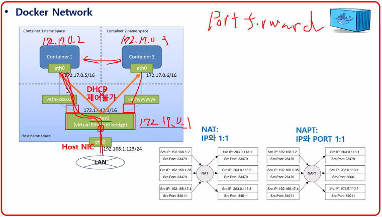

```
컨테이너를 사용하는 이유

1. 경량화
	- 최소한의 이미지
	- alpine : 5.54MB -> 최소한의 경량화된 이미지를 만들 수 있다.
		-> 최소한의 이미지를 가지고 서비스를 올릴 생각을 해야한다. (httpd : 145MB, centos : 204MB)

* 대량의 컨테이너들을 관리하기 위해서는 쿠버네티스를 반드시 사용해야 한다!
```

- Docker Network
    - 도커를 사용하면 가상 브릿지가 생성되고 설정해주지 않는 이상 172.17.0.1 사용
    - 컨테이너는 같은 네트워크에 위치하므로 내부 통신 가능
    - 외부에서 내부로 통신 가능 → 포트 포워딩 필요



- Docker Data Management
    - Volumes : 가장 권장하는 방식
        - 연결하는 파일끼리 바로 동기화가 된다.
        - 복사하는 것 보다 훨씬 더 쉽고 간단하게 효율적으로 반영할 수 있는 방법!
    - Bind mounts : 쉽다

- w : 접속한 사용자 목록 확인 가능
    - pts : 원격 접속한 유저임을 의미, 따라서 ip주소 10.0.0.253
    - tty : 직접 접속한 유저, vmware에서 접속했을 때, 따라서 FROM에는 아무것도 나오지 않음
    
    
    

- 아파치는 /bin/bash(쉘)를 실행하는 것이 아닌 데몬(서비스)을 실행하기 때문에 -d 옵션을 줘야함
    - 서비스 하는 것에 맞게 옵션을 줘야한다. → 쉘 실행하기 위해선 -it 옵션을 줘야함
    - 이게 다 귀찮으면 -itd 옵션 다 써주면 된다!

- 실행 중인 컨테이너 두 개기 때문에 네트워크 카드도 두 개!
    - ip a 명령어로 확인 가능하다.
    - 컨테이너 종료하면 그에 해당되는 네트워크 카드도 목록에서 사라진다.
    - veth로 시작하는게 바로 네트워크 카드


- 호스트 → 컨테이너로 파일 **복사** 가능! (반대도 가능하다)
    
    
    
    
    
    
    

- attach 명령어 : 컨테이너로 직접 접속하는 명령어
    
    
    
- exec 명령어 : 해당 컨테이너로 직접 접속하는 것이 아닌 바로 실행할 명령어를 이어붙여서 명령어 수행 가능!
    
    
    

- 디렉토리 복사
    - cp -r test test1
        - -r 옵션 필수!
    - 컨테이너 끼리 파일 복사는 불가능하다!
    
    
    

```
[link]

1. hardlink
	: inode number가 같은 완벽하게 동일한 파일 -> 다른 두 개의 파일 같아도 하나처럼 동작
	: 제약사항 - 파티션이 다르면 설정 불가, 파일 시스템이 달라도 설정 불가 ext4, xfs
							디렉토리 설정 불가

2. symboliclink
	: 윈도우 바로가기 아이콘처럼 원본 파일을 가르킴
	: Hardlink의 모든 약점 극복
```

- 심볼릭 링크 연결 시 내용이 동일하게 반영된다.
    
    
    
- 심볼릭 링크로 연결된 파일 삭제 시
    
    
    
- 심볼릭 링크 파일을 복사하게 되면 심볼릭 링크 대상이 되는 해당 원본 파일에 대한 디렉토리 내용만 나오게 된다. 전체 내용이 복사되진 않는다!
    
    
    

- Volumes
- 복사는 실행되고 있는 컨테이너에만 가능한데 volume은 실행되고 있는 컨테이너에 연결할 수 없다! → 컨테이너 실행할 때 같이 연결해줘야함
    - 복사보다는 볼륨을 공유해서 사용하는 것이 더 훨씬 편리하다!
        - 로컬에서 파일을 수정해도 볼륨에 의해 공유되고 있기 때문에 바로 반영 가능

- 볼륨 디렉토리가 이미 존재할 경우 무조건 절대 경로로 써줘야한다!
    - 없을 경우 자동 생성되면서 볼륨 연결까지 된다.
    - 컨테이너 생성 및 볼륨 연결 실행 한 번에 수행 명령어
    - -v : volume 옵션
    - /root/vol : docker volume
    - /vol : 컨테이너 디렉토리에 볼륨 연결
    
    
    

- 실습


- 실습2


- httpd의 web contents 디렉토리 : /usr/local/apache2/htdocs/
- nginx의 web contents 디렉토리 : /usr/share/nginx/html/
- docker volume 생성 및 index 파일 생성
    
    
    
- 이미지 생성 및 볼륨 연결 및 실행
    
    
    
- CentOS7-2에 haproxy 설치
    
    
    
- haproxy 설정 파일 수정
    - 동일 서버가 아닌 다른 서버에서 접근하는 것이므로 바로 서버 1의 도커 컨테이너에 접속 할 수 없다.
    - 가상 머신, 즉 가상 네트워크 내에서 로컬 호스트들은 내부 통신밖에 되지 않으므로 서버 1의 로컬 호스트 주소를 백엔드로 지정하면 도커에서 알아서 포트번호에 맞는 컨테이너로 찾아가게 해준다!
    - systemctl start haproxy
    
    
    

- 최종 네트워크 구성도


