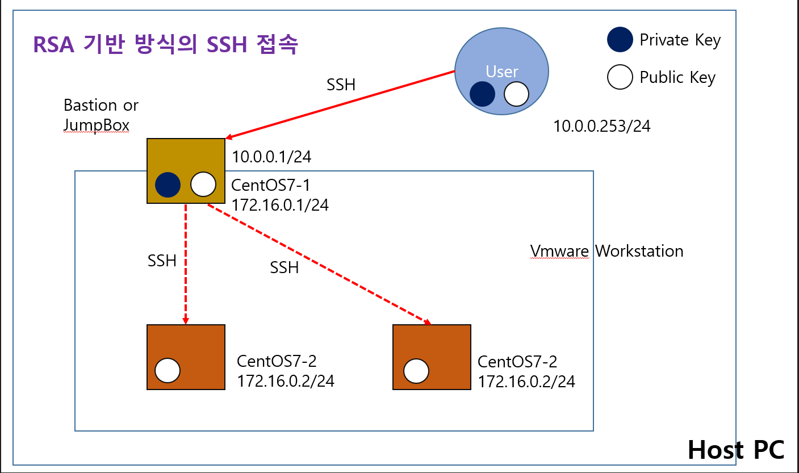

# 1. RSA 방식을 기반한 SSH 접속

- 네트워크 구성도
    
    
    
- 호스트 PC에서 RSA 키 생성하기
    - cmd 창에서 ssh-keygen 명령어로 private key와 public key를 생성한다.
    
    
    
    
    
    - public key 마지막 부분에 호스트 PC에 대한 정보가 들어있다. ‘=’ 이후로 다 지워도 상관없다! (공백 절대 있으면 안됨)
    
    
    
- 로컬 리눅스 서버로 공개 키 파일 전송
    - 리눅스 서버에 .ssh 디렉토리 생성
        - sudo su - : root 계정으로 전환
        - mkdir .ssh
    
    
    
    
    

- 리눅스 서버 암호화 방식 변경 - 설정 파일 수정
    - vi /etc/ssh/sshd_config
    - 38번째 줄 주석 제거
    - 64번째 줄 패스워드 암호화 방식 yes → no로 변경
        - 기존의 id, pw 방식 사용안하겠다는 설정으로 이 부분을 다시 yes로 수정하지 않으면 ‘등록 정보’에서 아무리 변경하려해도 되지 않는다!
    - systemctl restart sshd
    - 재시작까지 완료하면 이제 비밀번호 입력 없이 key로 바로 접속 가능하다!

- 로컬 리눅스 서버로 private key 전송하기
    
    
    
    
    

- CentOS7-2,3으로 공개 키 파일 전송
    - 마찬가지로 각각 mkdir .ssh로 디렉토리를 먼저 만들어줘야한다!
    - 파일 전송 후 디렉토리 목록 확인하고 마찬가지로 config 파일 동일하게 수정해주면 패스워드 암호화 방식에서 key 암호화 방식으로 변경된다.
    - 2번 서버 접속 : ssh root@172.16.0.2
        - 접속하려면 **개인 키 파일의 모드를 600**으로 변경해주어야한다.
            - chmod 600 .ssh/id_rsa
        - 1번 서버에서 이제 2번 서버로 바로 접속할 수 있다.
    
    
    
    
    
    - 3번 서버도 동일하게 진행
        - 파일 전송은 2번 → 3번으로 가능
        - 서버 접속은 개인키 가지고 있는 서버에서만 다른 서버로 접속 가능하다!
    
    
    

# 2. AWS 환경에 RSA 기반 인증 키 방식으로 서버 구축하기

- 키 페어 가져오기
    - 호스트 PC에서 만든 공개 키를 그대로 사용하려면 키 페어 생성 대신 가져오기를 하면 된다!
    - 공개 키 내용 복붙
    
    
    

- 인스턴스 생성
    - 서브넷 : ap-northeast-2a 사용
    - 퍼블릭 IP 자동 할당 : 비활성화
        - AWS는 인스턴스 실행 시 마다 public IP가 계속 자동 할당 되기 때문에 계속 바뀐다.
        - 이를 비활성화 해주고 추후에 탄력적 IP를 할당받아서 서버에 연결시켜주면 고정된 ip를 사용할 수 있다!
    - 인스턴스 3개 생성
    
    
    
    
    

- XShell에서 작업하기
    - 세션 등록해서 원격 접속
    - 인스턴스 생성 시 공개 키를 넣어주었기 때문에 각 3개의 서버에 공개 키는 이미 다 가지고 있는 상태이다!
    - 개인키만 호스트PC에서 서버 1로 전송하면 된다.
        
        
        
        
        
        - 파일 모드 변경
            
            
            
    
    - 서버 접속! - 2, 3번 서버 접속
        
        
        
    

# 3. Docker - 컨테이너 생성, 실행, LoadBalancer 적용

- 이미지 확인 명령어
    - docker images
    
    
    
- 도커 이미지 가져오기 - pull
    - httpd, alpine, nginx, centos
    
    
    
    
    
- 컨테이너 목록 확인 명령어
    - docker ps -a
    
    
    
- 컨테이너 접속 명령어
    - 컨테이너명으로 중지 가능
    
    
    
- 컨테이너 삭제 및 실행 명령어
    
    
    

- 60000 포트 열기
    
    
    

- 컨테이너 실행 및 접속하여 파일 수정
    
    
    

- 도커 컨테이너 정보 확인 명령어
    - docker inspect a1
        - ip 주소도 확인 가능!
    
    
    
    
    
- 모든 컨테이너 실행 종료
    - docker rm -f 4(docker ps -aq)
    
    
    

- LoadBalancing을 위한 haproxy 설치
    
    
    
    - 컨테이너 생성 및 실행 명령어 - 웹 서버 이미지 컨테이너
        
        
        
        - docker inspect h1 명령어로 ip 주소 확인 가능!
        
        
        
    
    - index.html 페이지 수정
        
        
        
    
    - 프록시 설정 파일에 백엔드 서버에 사용할 컨테이너 ip 주소 등록
        - vi /etc/haproxy/haproxy.cfg
        - systemctl restart haproxy
        - 3개의 컨테이너 등록!
        
        
        
    
- 로드밸런싱 적용 결과
    - 프록시의 라운드로빈 알고리즘에 의해 새로고침할 때 마다 1,2,3 서버 순서대로 접속
    
    
    
    
    
    
