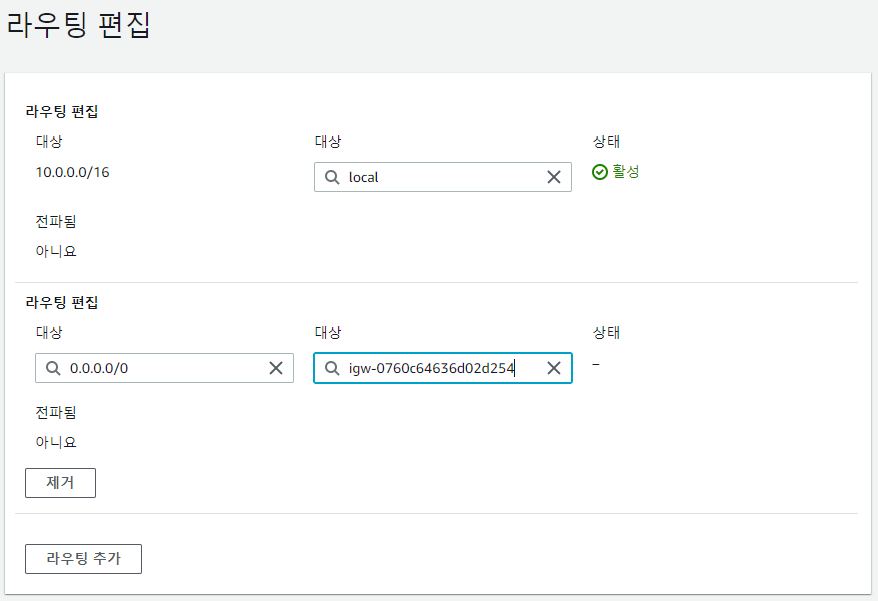

```
Router (Cisco : 2600. 3700. 7000)
1. 서로 다른 네트워크의 통신을 가능하게 한다.
2. Packet을 Routing Table에 의해서 최적의 경로로 전송한다.

Switch (Cisco : Catalyst 2950. 2960)
1. 동일한 Network에서 Node를 확장한다.
2. Frame을 Mac Address Table에 의해서 최적의 경로로 전송한다.
```

- 라우터는 목적지 주소만 알고 내보낸다 → 어디서 왔는지 확인 안함!
    - 10.0.0.0 255.255.255.0 → fast 0/0
    - 1.1.1.0 255.255.255.0 → serial 0/0
    - 10.0.1.0 255.255.255.0 → s 0/0 : 이건 직접 지정을 해줘야 함 → default static routing

    - 10.0.1.0 255.255.255.0
    - 1.1.1.0 255.255.255.0 → s 0/1
    - 10.0.0.0 255.255.255.0 → s 0/1
    - 0.0.0.0 0.0.0.0 → s 0/0 → s 0/0 : default static routing

    - ping을 보낸다 : seoul → busan
        - s : 10.0.0.1
        - d : 10.0.1.1
        - 먼저 목적지 주소를 보고서브넷 마스크를 확인하여 동일한 네트워크인지 부터 확인한다.
        - 다르다면 패킷을 게이트웨이로 보내버림
        - 게이트웨이에서는 이것을 라우터로 보내서 라우팅 테이블에 있는 정보를 바탕으로 어디로 보낼지 결정하고 보내버림 →

    - 라우팅 확인할 때 서브넷 마스크 길이를 판단해서 확인한다 → 0.0.0.0/0을 꼭 넣어줘야 외부 통신이 가능하다!

    


## 라우팅 테이블, 게이트웨이, NAT 게이트웨이 생성 및 연결하기

- terraform 코드 작성

    


- terraform plan
- terraform apply

- 라우팅 테이블 생성 결과
    - 아까 인터넷 게이트웨이에 외부 통신을 위해 추가해준 ip 영역이 활성화 되어있는 것을 확인할 수 있다.

    


- 서브넷 연결
    - 라우트 테이블과 서브넷 또는 라우트 테이블과 인터넷 게이트를 연결하기 위한 association 생성

    

    

    - terraform plan, terraform apply
    - 결과
        - 라우팅 테이블에 서브넷 연결된 것을 확인할 수 있다.

        


- EC2 서버 생성하기
    - 생성한 VPC와 서브넷 weba로 설정하고 외부에서 접속하는 유저가 있을 때라고 가정 하에 퍼블릭 IP를 활성화 해놔야한다.

        


    - 인스턴스 생성 시 web 서버 및 index.html 편집 위해 사용자 데이터 추가

        


    - 인바운드 규칙 편집 - 원격 접속 및 80 포트 open

        


    - 다음과 같이 접속

        


    - 하지만 외부랑은 통신이 되는 상태가 아니다! → NAT 게이트웨이를 설정해줘야한다.
        - 내부 → 외부로 통신은 되지만, 외부 → 내부로 통신은 안됨
        - 내부에 DB 서버가 있다고 했을 때 인터넷을 이용하여 업데이트를 진행하거나 할 때 사용된다.

    - NAT Gateway 생성하기

        

        - terraform plan, terraform apply
            - nat gateway는 생성하는데 시간이 좀 걸린다

        - 결과

            


    - NAT 게이트웨이 - 라우터 연결
        - 다음은 잘못 연결한 것 → NAT 게이트웨이가 아닌 인터넷 게이트웨이로 설정해놨기 때문에 ec2 public ip로도 접속 할 수 있었던 것

        

        - 이렇게 NAT 게이트웨이로 제대로 연결하면 was와 db는 외부에 노출되어 있지 않기 때문에 외부에서 내부(외부 → 내부)로 접속할 수 없다!!!
            - 따라서 공인 ip가 아닌 내부 ip로 ssh 접속 해야한다!

            


    - terraform plan, terraform apply
    - 결과

        


    - NAT 게이트웨이 - 라우터 연결 후 서브넷  연결을 위한 association 생성

        

        - 결과
            - 서브넷 연결되어 있는 것을 확인할 수 있다.

            


- Security Group 생성하기

    

    - tf 코드

        ```
        resource "aws_security_group" "cyahn_sg" {
          name = "cyahn-sg"
          vpc_id = aws_vpc.cyahn_vpc.id
          description = "aws_ftp-ssh-http-mysql"

          ingress = [
            {
                description = "ssh"
                from_port = 22
                to_port = 22
                protocol = "tcp"
                cidr_blocks = ["0.0.0.0/0"]
                ipv6_cidr_blocks = ["::/0"]
                prefix_list_ids = null
                security_groups = null
                self = null
            },

            {
                description = "http"
                from_port = 80
                to_port = 80
                protocol = "tcp"
                cidr_blocks = ["0.0.0.0/0"]
                ipv6_cidr_blocks = ["::/0"]
                prefix_list_ids = null
                security_groups = null
                self = null
            },

            {
                description = "mysql"
                from_port = 3306
                to_port = 3306
                protocol = "tcp"
                cidr_blocks = ["0.0.0.0/0"]
                ipv6_cidr_blocks = ["::/0"]
                prefix_list_ids = null
                security_groups = null
                self = null
            },

            {
                description = "icmp"
                from_port = -1
                to_port = -1
                protocol = "icmp"
                cidr_blocks = ["0.0.0.0/0"]
                ipv6_cidr_blocks = ["::/0"]
                prefix_list_ids = null
                security_groups = null
                self = null
            },

            {
                description = "ftp"
                from_port = 21
                to_port = 21
                protocol = "tcp"
                cidr_blocks = ["0.0.0.0/0"]
                ipv6_cidr_blocks = ["::/0"]
                prefix_list_ids = null
                security_groups = null
                self = null
            },

            {
                description = "ftp-data"
                from_port = 65000
                to_port = 65100
                protocol = "tcp"
                cidr_blocks = ["0.0.0.0/0"]
                ipv6_cidr_blocks = ["::/0"]
                prefix_list_ids = null
                security_groups = null
                self = null
            }
          ]

          egress = [{
            description = "all"
            from_port = 0
            to_port = 0
            protocol = -1
            cidr_blocks = ["0.0.0.0/0"]
            ipv6_cidr_blocks = ["::/0"]
            prefix_list_ids = null
            security_groups = null
            self = null

          }]

          tags = {
            "Name" = "cyahn-sg"
          }
        }
        ```


    - 결과

        


- 키 페어 생성

    

    - 결과

        


## 실습


- loadbalancing 안됐던 이유
    - weba의 http 서버가 80 포트로 되어있고 haproxy의 포트도 80 포트로 지정되어 있어 로드밸런싱이 아예 되지 않았다.
    - vi /etc/httpd/conf/httpd.conf
        - 위 명령어로 설정파일의 Listen:80 → 8080으로 변경해주었다.
        - weba의 httpd 서버의 포트를 8080으로 변경해준 것이다.
    - haproxy의 포트는 그대로 80을 쓰고 따라서 프론트에서 [cyahn.xyz](http://cyahn.xyz) 로 접속하면 80포트로 접속을 하는 것이며 여기서 바로 프록시로 접속하게 되어 로드밸런싱이 이루어지게 된다!

    
