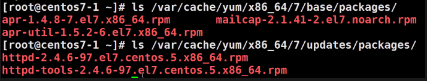

# 1. 패키지 관리

```
1. Package 관리
	(1) yum (Yellow DogUpdate Manager)                    apt                       xypper
		- 의존성 문제 해결
		- 인터넷 상의 저장소에서 파일 다운로드 후 설치
		- update 역시 명령어 만으로 가능
		- 사용자의 입맛에 따라 설치 불가능
			 - 설치 위치
			 - 필요한 Module 선택 불가능

	(2) RPM(Redhat Package Manager)                       dpkg
		- 의존성 문제에서 완전히 자유롭지 못하다
		- Source 설치에 비해서 쉽다.
		- Source 파일을 모아서 Package를 만들 수 있다. 쉽지는 않다.
		
	(3) Source(Binary) Install
		- Customizing 가능 -> 설치 경로 지정 가능(나머지 두 개는 불가능!)
		- 설치가 너무 어렵다
		- Update가 너무 어렵다
		- 엄청난 의존성 문제에 직면한다.

firewall <- 운영체제 + security ---> csp

acg, sg <- 외부에 존재하는 방화벽

2. Source 3단계
	환경설정 : 설치 위치나 필요한 모듈, 파일 지정
					# ./configure --prefix=설치경로  --with-모듈=경로
	Compile : 인간이 식별할 수 있는 언어로 프로그래밍 된 파일을 기계어로 번역하는 작업
					# make
	install
					# make install
```

- 추후 웹 서버를 직접 구축해야 할 때 지정된 경로에 설치하는 것이 아닌 원하는 경로에 커스터마이징 하여 설치해야할 때 source install 방식으로 진행해야 한다.
    - yum과 rpm은 경로가 지정되어 있기 때문에 커스터마이징 불가!

### [yum의 특징]

- yum은 파일 설치 시 의존성이 있는 파일들을 같이 설치해준다.
- 최신 버전이 아닌 안정화된 버전을 다운받고, 버전을 선택할 수 없다는 단점이 있다.
- 명령어로 패키지 목록과 업데이트가 필요한 패키지 목록을 확인할 수 있다.
    
    
    

- yum install -d : download only, 설치하지 않고 설치 파일만 다운!
    - 설치가 되면 설치 파일은 삭제
- yum cleanall : 레포지토리가 오류나면 정리하는 명령어
- /var/cache : 삭제해도 다시 생겨나는 디렉토리, 실행 시마다 재생성!
- /etc/yum.repos.d
    - 본 디렉토리 하위 파일들은 삭제하면 안된다.
    - 삭제하게 되면 인터넷 외부 접속 안되기 때문에 절대 삭제하지 말 것!

# 2. Source install 실습

- **로컬 리눅스 서버**에 설치 해보기

```

mkdir /web
cd /web

yum install -y gcc gcc-c++ expat-devel wget
wget https://downloads.apache.org/httpd/httpd-2.4.54.tar.bz2
wget https://downloads.apache.org/apr/apr-1.7.0.tar.bz2
wget https://downloads.apache.org/apr/apr-util-1.6.1.tar.bz2
wget http://sourceforge.net/projects/pcre/files/pcre/8.45/pcre-8.45.tar.bz2 --no-check-certificate
tar xvfj httpd-2.4.54.tar.bz2
tar xvfj apr-1.7.0.tar.bz2 
tar xvfj apr-util-1.6.1.tar.bz2 
tar xvfj pcre-8.45.tar.bz2

cd apr-1.7.0
./configure --prefix=/web/apr ; make ; make install
cd ../apr-util-1.6.1
./configure --prefix=/web/aprutil --with-apr=/web/apr ; make ; make install
cd ../pcre-8.45
./configure --prefix=/web/pcre ; make ; make install
cd ../httpd-2.4.54
./configure --prefix=/usr/local/apache2 --with-apr=/web/apr --with-apr-util=/web/aprutil --with-pcre=/web/pcre/bin/pcre-config ; make ; make install

firewall-cmd --permanent --add-port=80/tcp
firewall-cmd --reload
cat > /usr/local/apache2/htdocs/index.html << EOF
<html>
<body>
<h1>CYAHN-WEBSERVER</h1>
</body>
</html>
EOF

 /usr/local/apache2/bin/apachectl start
```

- gcc, gcc-c++ : C 컴파일러, C++ 컴파일러
- wget : 링크 주소로 설치
- tar
    - tape archive
    - -c : 압축 명령어
    - -x : 해제 명령어
    - -v : 작업과정 상세히 확인
    - -f : 필수 옵션 파일명 지정
    - -t : 해제하지 않고 내부파일 확인
- ./configure → make → make install : source 설치 과정

- 위 과정을 bash 파일로 저장해서 파일 실행으로 한번에 다 설치될 수 있도록 할 수 있다.
    - 파일 맨 위에 #! /bin/bash를 반드시 작성해줘야한다.
    - sh [web.sh](http://web.sh)
        - bash 파일 실행 명령어

- **네이버 클라우드**에 설치 해보기
    - bash 파일로 만들었던 내용을 init Script로 등록하여 서버 실행 시 자동으로 실행되게 설정할 수 있다.
    
    
    
    - 만약 daemon 유저 에러가 발생한다면 해당 유저가 존재하지 않기 때문에 발생한 오류이므로 추가해주면 된다.
        - useradd daemon

- **AWS**에 설치 해보기
    - AWS 인스턴스 생성 - user_data 이용
        
        
        
        
        
        
        
    
    - 사용자 데이터에 넣을 명령어들
        
        ```
        #! /bin/bash
        
        mkdir /web
        cd /web
        
        yum install -y gcc gcc-c++ expat-devel wget
        wget https://downloads.apache.org/httpd/httpd-2.4.54.tar.bz2
        wget https://downloads.apache.org/apr/apr-1.7.0.tar.bz2
        wget https://downloads.apache.org/apr/apr-util-1.6.1.tar.bz2
        wget http://sourceforge.net/projects/pcre/files/pcre/8.45/pcre-8.45.tar.bz2 --no-check-certificate
        tar xvfj httpd-2.4.54.tar.bz2
        tar xvfj apr-1.7.0.tar.bz2 
        tar xvfj apr-util-1.6.1.tar.bz2 
        tar xvfj pcre-8.45.tar.bz2
        
        cd apr-1.7.0
        ./configure --prefix=/web/apr ; make ; make install
        cd ../apr-util-1.6.1
        ./configure --prefix=/web/aprutil --with-apr=/web/apr ; make ; make install
        cd ../pcre-8.45
        ./configure --prefix=/web/pcre ; make ; make install
        cd ../httpd-2.4.54
        ./configure --prefix=/usr/local/apache2 --with-apr=/web/apr --with-apr-util=/web/aprutil --with-pcre=/web/pcre/bin/pcre-config ; make ; make install
        
        cat > /usr/local/apache2/htdocs/index.html << EOF
        <html>
        <body>
        <h1>CYAHN-AWS-WEBSERVER</h1>
        </body>
        </html>
        EOF
        
         /usr/local/apache2/bin/apachectl start
        ```
        
    - 하지만 접속이 안되는 오류가 발생했다.
        - /usr/local/apache2 가 제대로 생성되지 않아서 발생하는 오류같다.
        - 다 동일하게 했는데 왜 제대로 실행이 안되는 지 모르겠다!!!
        - 오류 잡으면서 알게 된 내용들
            - /var/log/cloud-init-output.log
                - 로그 파일, 로그 보면서 확인 가능
                - cat /var/log/cloud-init-output.log | grep 키워드
                    - 키워드 검색하고 싶을 때 grep 명령어를 사용!
            - sudo su -
                - Amazon Linux 2에 접속할 때 일반 계정으로 접속하기 때문에 디렉토리 생성과 같은 작업을 아무것도 할 수 없어서 root 계정으로 변경해야 한다.
            - netstat -ant
                - 실행 프로세스 목록 확인
    
    - 강사님께 여쭤보고 해결해야 겠다!^_^
