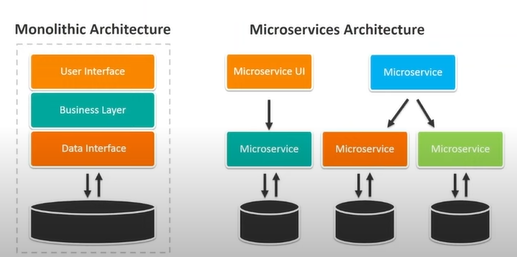

## MSA 구조란?

- 비용 절감 및 사업 효율화를 위해 **클라우드**를 도입하는 추세이며 이미 그 추세의 시작은 한참 전에 시작되었다.
  - 하지만 단순 도입 만으로는 클라우드를 제대로 활용할 수 없다.
  - 따라서, 넷플릭스가 도입하여 사용하고 클라우드를 잘 활용하기 위한 Cloud Native 디자인 패턴으로 알려진 마이크로 서비스 아키텍처의 중요성이 나날히 상승하고 있다.

- 모놀리틱 구조와 비교해서 생각할 수 있다.
  - 모놀리틱 구조란?
    - 애플리케이션 안에 모든 비즈니스 로직이 다 들어가 있는 구조
    - 여태까지 진행했던 프로젝트들은 다 모놀리틱 구조이다.
    - 하나의 서버, 하나의 DB로 모든 서비스들을 다 운영하였기 때문!
- 마이크로 서비스 아키텍처는?
  - 애플리케이션의 각 서비스들을 ‘마이크로 서비스’라는 단위로 쪼개어서 구성하는 것을 의미
  - 따라서 기능을 담당하는 서비스별로 서버, DB를 구축하여 여러 대의 서버와 여러 대의 DB로 하나의 큰 서비스를 배포해 운영하는 것이다.

- 현재까지 내용을 기반으로 한 궁금증
  - API Gateway는 어떤 것을 사용하는 가?
  - 데이터베이스를 여러 개 사용하는데, 만약 [구매]라 치면 상품 정보와 구매자, 즉 회원 정보가 같이 필요하게 되는데 각각 데이터가 다른 데이터베이스에 저장되어 있으므로 외래키로 사용할 수 없는데 이렇게 되면 단순히 하나의 필드로 저장해버리는 것인가? → 이렇게 되면 상품이 삭제되는 경우나 회원이 탈퇴하는 경우 데이터 싱크를 어떻게 맞추지?

- MSA 구조가 인기있는 이유?
  - 유연성 대처 용이
  - 서비스 간의 느슨한 결합 → 장애 대응 유리
  - 효율적인 리소스 사용 → scale out 용이
  - 손쉬운 배포 및 업데이트
    - 예1) 신규 기능 추가 후, 배포는 어떤 식으로 진행?
      - 모놀리틱 : 신규 업데이트가 추가된 코드의 바이너리 파일을 만들어 배포 → 여기서 바이너리 파일은 jar, war 파일을 의미하는 것일까? ( 찾아보기)
      - MSA : Blue - Green 배포 방식을 사용하여 점진적으로 변경, Green으로 트래픽이 다 넘어가더라도 Blue를 남겨두어 롤백이 바로 가능하도록!
    - 예2) 만약 문제가 발생 시 재배포는 어떻게 진행?
      - 모놀리틱 : 잘못된 부분을 수정 후 다시 바이너리 파일을 만들어 재배포
      - 잘못된 부분이 있는 서비스의 소스 코드만 일부 수정한 뒤 컨테이너화하여 해당 부분만 재배포

## MSA를 구축하기 위해 알아야할 것들 - 구성요소, 기술

- MSA 아키텍처를 구성하기 위해 어떤 기술과 구성요소를 알아야 할까?

  - 내가 제일 궁금했던 부분!!!!!!!!!!!!!!!!!!!!!!!!
  - 환경 변수 따로 관리..? → 뭔 말인지 감이 안잡힘

- MSA를 구성하는 주요 Component

  - Config Management
    - MSA 구조의 기반이 되는 이미지에 환경 변수가 들어간다고 가정했을 때, 환경변수 변경 시마다 이미지를 새로 재빌드 해야 한다.
    - 환경 변수를 별도의 객체로서 관리할 수 있는 구성요소
  - Service Discovery
    - 각 서비스에 대한 위치 정보를 가진 구성 요소
    - MSA 구조는 마이크로 서비스로 구성되어 있기 때문에 각각의 서비스가 서로를 호출할 때 각 서버의 ip 주소라던지 port 번호가 필요하기 때문에 각 서비스에 대한 정보를 관리할 구성 요소가 필요하다.
  - API Management
    - 마이크로 서비스 자체를 외부에 공개하지 않는다!!!
    - 따라서 제일 앞단에 API Gateway를 줘서 허용된 접근인지에 대한 판단, 트래픽 조절과 같은 기능을 담당하는 구성 요소
  - Centralized Logging
    - 서비스별 로그의 중앙 집중화
    - 각 마이크로 서비스로 분산화 되어있기 때문에 각 서비스들의 로그를 중앙으로 집중화 시킬 필요가 있다.
    - 따라서 집중화 시킨 로그의 관리를 담당하는 구성 요소
  - Distributed Tracing
    - 마이크로 서비스 간의 호출 추적
    - 각 서비스 간의 호출을 로그로 추적할 수 있어야 장애 발생 시 대응이 가능하기 때문에 호출 추적하는 기능과 로그를 중앙 집중화 시키는 요소와 같이 사용된다.
  - Centralized Monitoring
    - 서비스가 분산화 되어 있더라도 결국 모니터링은 하나의 대시보드에서 이루어져야 하기 때문에 서비스별 매트릭 정보를 중앙집중화 할 필요가 있다.
  - Resilience & Fault Tolerance
    - A 서비스 → B 서비스를 호출하였는데 B 서비스에서 어떤 문제에 의해 응답을 하지 않는다면 A 서비스에서는 스레드가 무한 대기 상태로 빠지게 된다.
    - 이렇게 지속적으로 스레드가 대기 상태로 쌓이게 되면 결국 A 서비스에도 영향을 미치게 되고 이로 인해 전체 서비스의 장애로도 이어질 수 있기 때문에 이러한 파급 효과를 발생시키지 않아야 한다.
    - 따라서 서비스 사이에 Circuit Breaker를 둠으로써 만일 일정 시간 내에 응답을 하지 않으면 다른 response를 보내 대처할 수 있도록 해야 한다.
  - Auto-Scaling & Self-Healing
    - 자동 스케일링, 복구 자동화를 통한 서비스 관리 효율화
    - 쿠버네티스를 사용할 때 자동화 기능을 통해 효율적으로 관리할 수 있다고 한다 → 쿠버네티스를 사용해보지 않아서 아직은 잘 모르겠다!

- MSA를 구현하는 기반 기술

  

  - 가장 크게 두 가지 기술을 주로 사용한다.

  - Spring Cloud

    - Spring과 JAVA를 사용한다면 사용하기 적합!

  - Kubernetes

    - 오픈소스로, 굉장히 활발하게 사용되고 있다.

    - 따라서 여러 트러블 슈팅도 가능하고 이미 적용되어 사용된 사례들도 많이 찾아볼 수 있어 개발에 많은 도움이 될 것이라 예상

    - 쿠버네티스를 사용한다면 **Service Mesh 구조**도 고려해봐야 할 것!

      - 마이크로 서비스 간의 호출 및 통신 로직을 개발자가 다 관리하고 처리하기에는 매우 힘들다.
      - 따라서 마이크로 서비스를 배포할 때 프록시 서버를 같이 띄워서 통신 관련 부분을 전담할 수 있도록 할 수 있다. → 알아서 로드밸런싱부터 통신까지 다 담당하게
      - Service Mesh 서비스들
        - **ISTIO**, LINKERD 2, CONSUL, Traefik mesh, KUMA, Open Service mesh

      

## MSA 도입 시 어려움

- 마틴 파울러
  - 디자인 패턴으로 굉장히 유명
  - 매우 복잡한 시스템이 아니라면 모놀리틱이 더 적합하다라는 말을 했다.
- 복잡성
  - 서비스 메쉬를 사용하면 런타임 인스턴스 수가 증가
- 사이드 카 컨테이너 수 증가
  - 각 서비스는 서비스 메쉬의 사이드카 프록시를 통해 호출되기 때문에 개별 프록시 수가 증가
  - 이에 따른 부하로 서비스 운영에 문제가 발생할 가능성이 있는지에 대해 아키텍처 구조 측면에서 사전 검토 필요
- 기술력의 미성숙
  - 서비스 메쉬에 대한 경험이 없다.
  - 빠르게 발전하고 있지만 아직은 미성숙한 기술에 속한다.
